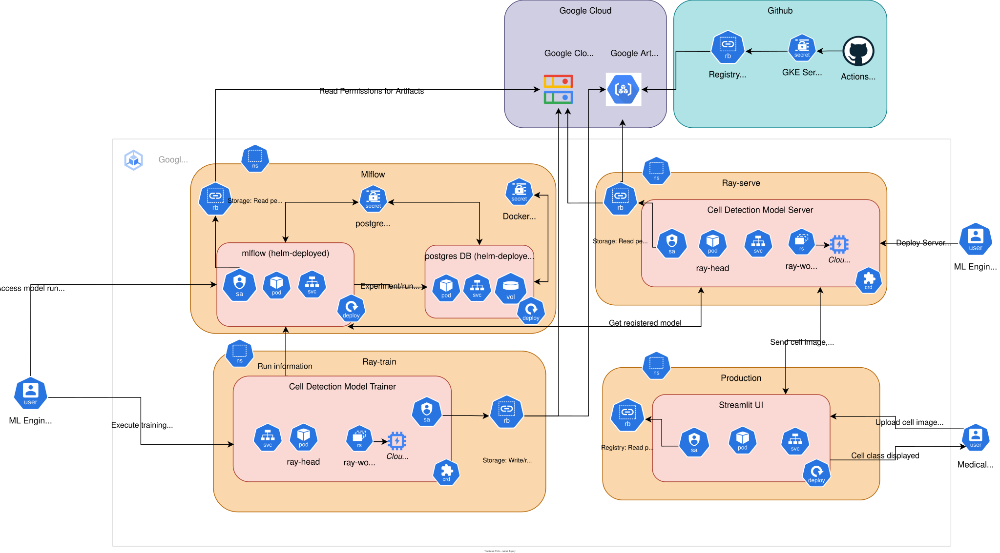

# The Haem Dream

## Motivation

A tedious process in haematology pathology labratories is viewing blood films and laborously looking through a microscope to find anomolous cells and features that could indicate pathology. AI/ML techniques have been applied to automate this process, however, whole slide imagary (WSI) analysis is still in its infancy. Google's MedGemma 1.5 4B [Technical Report](https://arxiv.org/pdf/2604.05081) was released in January 2026 and has been improved over the original version by including WSI in its training set. However, from experimentation, MedGemma is not able to classify haemotological disease, possibly due to only training on anatomical pathology specimens, which do not require the same degree of magnification. Given haematology pathology requires higher magnification, more image samples are required to make a diagnostic conclusion, thus, a vision LLM may not be suited for this task.

This project aims to explore different approaches to this problem. As an initial exploration,
[Yarikan et al. 2026: A Large-Scale Peripheral Blood Cell Dataset for Automated Hematological Analysis](https://www.nature.com/articles/s41597-026-06761-y) recently released a large scale blood cell data image dataset, which would be used to identify anomoulous cells. The dataset is high quality (Cohen’s kappa >0.85 for all classes) and available via [Zenodo](https://zenodo.org/records/17333317). A small model such as DenseNet-121 (~8M paramaters), which was outlined in the paper as the highest performing, may be well suited for such a computationally expensive pass. Results from these classifications could be aggregated and passed to a larger vision language model operating at a lower magnification.

The first stage of this project is to replicate the results on Yarikan's paper. The project is designed to work with Google Kubernetes Engine, though code, manifests, etc are vendor agnostic so could be run elsewhere.

## System Overview
Each folder contains code, dockerfiles and manifests for their respective components.
* `ui/` contains assets for user web interface 
* `ray-train` contains assets for distributed training of image detection model
* `ray-serve` contains assets for serving a logged model
* `notebooks` contains Jupyter notebooks used for EDA
* `helm_carts` contains the value files used for the Helm deployments of mlflow and postgres

### What is working?

* MLflow and postgresDB instances deployed via helm chart with correct Secrets, SAs etc.
    * Mlflow uses Google Cloud Storage as a backend for artifact storage
* Ray training code is running and will train a Densenet-121 model.
    * Variations from paper:
        * Cell images were altered as per common computer vision training tasks
            * Brightness, contrast variations common according to SME
            * Flipped to generalise cell structure
            * AdamW optimizer used over Adam
* Streamlit UI is deployed into production namespace
* CI/CD implemented via Github Actions to build ray train, ray serve and Streamlit UI images, as well as autonomously deploying the streamlit image on build.
* Appropriate role bindings for each deployment, GCS/GAR work as expected

### What is not working?
* Streamlit UI is bare-bones and needs polish

## Version History
* v1.0.0 was released for ML engineering job application deadline

## References
### Paper & Dataset
* https://www.nature.com/articles/s41597-026-06761-y
* https://zenodo.org/records/17333317

### Technical References
* https://docs.github.com/en/actions/how-tos/deploy/deploy-to-third-party-platforms/google-kubernetes-engine
* https://community-charts.github.io/docs/charts/mlflow/google-cloud-storage-integration
* https://artifacthub.io/packages/helm/bitnami/postgresql
* https://docs.ray.io/en/latest/data/working-with-images.html
* https://docs.cloud.google.com/kubernetes-engine/docs/add-on/ray-on-gke/quickstarts/ray-gpu-cluster
* https://docs.cloud.google.com/kubernetes-engine/docs/how-to/autopilot-gpus

### Stretch goals
* https://docs.ray.io/en/latest/train/user-guides/asynchronous-validation.html
* https://docs.ray.io/en/latest/tune/examples/tune-mlflow.html
* Use Google FUSE instead of python libs to download dataset in training code